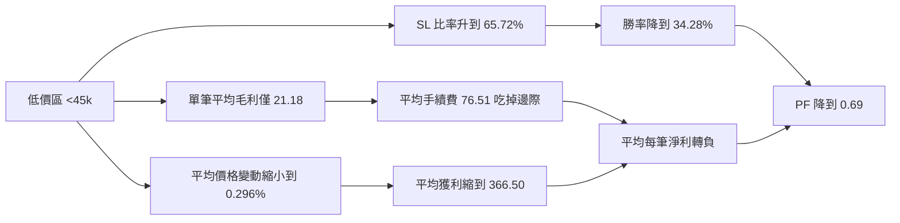

# BTC 交易策略三年回測與價格區間績效分析報告

## 執行摘要

本次分析以你提供的三份回測 Excel 為主，結論非常明確：**策略的績效高度依賴 BTC 價格區間**。整體三年合併後，策略幾乎只是打平，合計淨利約 **+253.61 USDT**、PF 約 **1.00**；但這個近乎打平的總結果，其實是由 **y1 大幅虧損**、**y2 小幅獲利**、**y3 強勁獲利** 所疊加而成。換言之，**目前以 y3 調出的參數，對 2025–2026 的高價區 regime 很有效，但對 2023–2024 的低價區明顯失效**。

價格分段的結果與你的觀察一致。若以三年合併後的**等距分段**來看，最低價區 **24.9k–44.9k** 的表現最差：**601 筆交易、勝率 34.28%、PF 0.69、總淨利 -33,249.84 USDT**；而高價區表現顯著改善，尤其 **84.8k–104.8k** 這個區間在樣本數與穩健性之間最平衡：**187 筆、勝率 45.45%、PF 1.43、總淨利 +11,578.01 USDT**。若改用**分位數分段**，最佳廣義高價區落在 **86.0k–124.7k**，有 **273 筆、勝率 47.25%、PF 1.46、總淨利 +18,054.04 USDT**。這表示「**高價 regime 明顯優於低價 regime**」不是單一分箱方法造成的假象。

低價區失效並不是因為虧損單特別大，而是三個因素同時發生。第一，**費用吃掉太多邊際**：最低價區的平均單筆**費前毛利只有 +21.18 USDT**，但**平均手續費卻高達 76.51 USDT**，也就是說策略在低價區的毛邊際根本不夠覆蓋 friction。第二，**止損占比明顯較高**：最低價區的 SL 比率為 **65.72%**，而核心高價區 **84.8k–104.8k** 只有 **54.55%**。第三，**獲利端變小、虧損端沒變小**：最低價區平均獲利約 **366.50 USDT**，明顯低於核心高價區的 **454.96 USDT**；但平均虧損絕對值卻相近，分別是 **275.32** 與 **265.62 USDT**。因此低價區的問題，本質上是「**勝率下降 + 獲利端縮水 + 費用占比過高**」，而不是單純槓桿過大。

從穩健性來看，**最高點估計**雖然出現在 **104.8k–124.7k**，但這個區間只有 **96 筆**，樣本相對較小，且對少數大賺單較敏感；相較之下，**84.8k–104.8k** 更適合作為「目前最值得信任的最佳價格區間」。這個區間在 bootstrap 下仍維持正向，且即使移除前 5 筆最大獲利交易後，PF 仍有 **1.27**、累計淨利仍為 **+7,345.42 USDT**，代表它不是靠一兩筆幸運單撐起來的。

若轉成可執行的改善建議，最直接的是**價格地板與分級倉位**。用現有交易紀錄做「靜態重估」後，若簡單地把 **入場價 < 45k** 的交易全部拿掉，三年合併結果會從基準策略的 **+253.78 USDT / PF 1.00 / 最大回撤 321.93%**，改善成約 **+32,820.09 USDT / PF 1.29 / 最大回撤 26.51%**。若採更保守的分級倉位：**<45k 不交易、45k–85k 半倉、≥85k 全倉**，則估計可到 **+25,534.38 USDT / PF 1.33 / 最大回撤 14.35%**。這些數字不是重新回測，而是基於既有交易序列的靜態縮放估計，但方向性非常清楚：**低價區應該過濾或降槓桿，而不是照現狀直接參與。**

## 資料與方法

本報告直接使用你提供的三份回測檔：

- y1：2023-04-14 ~ 2024-04-13
- y2：2024-04-14 ~ 2025-04-13
- y3：2025-04-14 ~ 2026-04-09

其中 y3 檔名雖然寫到 2026-04-13，但摘要頁實際回測結束時間是 **2026-04-09 14:19**。三份回測摘要皆顯示 **Tick 覆蓋率 100%、無缺失 tick bar**，因此資料完整性本身不是本次差異的主要來源。

目前你**沒有提供**下列對本題很重要的欄位：

- **出場時間**
- **BTC 的 1m / 1h 價格時間序列**
- **逐筆滑價、MFE、MAE、止損價/目標價明細**
- **未成交 / 被 filter 擋掉的訊號紀錄**

因此本報告做了三個必要假設：

- **價格分段**以「**入場價**」作為該筆交易的價格 regime proxy。
- **平均持倉時間**因缺少出場時間，**無法直接計算**，表格以「—」表示。
- **波動率**以「該段交易的 `log(出場價 / 入場價)` 標準差」作為**交易層級波動率代理**，它可做橫向比較，但**不等同真正的 1m / 1h 市場 realized volatility**。

另外，我也做了敏感度檢查：把 regime proxy 改成 **(入場價 + 出場價) / 2** 重新分箱，結論仍然是**高價區顯著優於低價區**，所以這個結果不是單純被「只看入場價」的定義綁死。

從策略程式來看，這是一個**單一持倉狀態機**，同時間只會有一筆部位；多空都使用固定的 cost model，包含 **taker fee 0.032%** 與 **slippage 0.2 bps**，並有成本覆蓋門檻；程式也已經保留 `k0_records` 供外部分析，但目前 Excel 匯出沒有把這些特徵一起帶出來。這代表：**回測內的滑價假設本身是常數，無法從目前匯出檔去量化「不同價格區有不同滑價」；若要做真正的微結構診斷，未來要把 k0 / MFE / MAE / exit time 一起匯出。** fileciteturn0file0

## 三年整體績效比較

### 三年整體指標比較

| 年度 | 回測區間 | 交易數 | 勝率% | 平均每筆淨利 | 總淨利 | PF | 最大回撤% | 期末餘額 | 期間報酬% | 年化報酬率%* |
|---|---|---:|---:|---:|---:|---:|---:|---:|---:|---:|
| y1 | 2023-04-14 ~ 2024-04-13 | 752 | 36.40 | -37.01 | -27,830.77 | 0.79 | 321.93 | -17,830.77 | -278.31 | — |
| y2 | 2024-04-14 ~ 2025-04-13 | 388 | 41.20 | 17.87 | 6,932.48 | 1.11 | 33.36 | 16,932.48 | 69.32 | 69.39 |
| y3 | 2025-04-14 ~ 2026-04-09 | 230 | 50.00 | 91.96 | 21,151.90 | 1.67 | 10.06 | 31,151.90 | 211.52 | 216.12 |

\* y1 因期末餘額為負，傳統 CAGR 不具意義，故以「—」表示。

這張表最重要的訊息有三個。

第一，**策略整體並不穩健**。如果只看 y3，你會覺得這是一個高成長、低回撤、勝率與 PF 都不錯的策略；但拉長到三年後，y1 的巨大虧損幾乎把 y2 與 y3 的獲利吃光，三年合併只剩接近打平。

第二，**策略選擇性明顯變強**。若把交易頻率換算成每 30 天交易數，y1 約 **61.6 筆**、y2 約 **31.9 筆**、y3 約 **19.1 筆**。交易變少，同時勝率與 PF 持續改善，代表目前參數更像是在**挑高品質交易**，而不是用更多交易堆表現。

第三，**y3 參數對近一年市場結構高度適配**。y3 勝率從 y1 的 36.4% 提升到 50.0%，PF 從 0.79 拉到 1.67，最大回撤則從 321.93% 壓到 10.06%。但因為目前參數本來就是用 y3 調出來的，這種提升必須同時用「**有效**」與「**可能有 regime overfit**」兩種角度來看。

## 價格分段績效分析

### 等距分段

下表使用三年合併後的入場價做 **5 段等距分箱**。

| 價格區間 | 交易數 | 勝率% | 平均淨利 | 總淨利 | PF | 平均持倉時間 | 波動率代理% |
|---|---:|---:|---:|---:|---:|---|---:|
| 24.9k–44.9k | 601 | 34.28 | -55.32 | -33,249.84 | 0.69 | — | 0.391 |
| 44.9k–64.8k | 217 | 42.86 | 16.57 | 3,595.43 | 1.11 | — | 0.568 |
| 64.8k–84.8k | 268 | 43.66 | 44.07 | 11,810.14 | 1.29 | — | 0.494 |
| 84.8k–104.8k | 187 | 45.45 | 61.91 | 11,578.01 | 1.43 | — | 0.545 |
| 104.8k–124.7k | 96 | 50.00 | 70.66 | 6,783.51 | 1.50 | — | 0.355 |

等距分段幾乎呈現**單調改善**：價格越高，勝率、PF、平均淨利越好。最高價區的點估計最好，但樣本只有 96 筆；如果同時考慮樣本與穩健性，**84.8k–104.8k** 是比較合理的核心優勢區。

### 分位數分段

下表改用三年合併後的入場價做 **5 段分位數分箱**，每段樣本數接近一致。

| 價格區間 | 交易數 | 勝率% | 平均淨利 | 總淨利 | PF | 平均持倉時間 | 波動率代理% |
|---|---:|---:|---:|---:|---:|---|---:|
| 24.9k–29.1k | 274 | 32.85 | -59.39 | -16,273.62 | 0.68 | — | 0.408 |
| 29.1k–42.2k | 274 | 32.85 | -69.07 | -18,925.65 | 0.63 | — | 0.373 |
| 42.2k–65.2k | 274 | 44.53 | 24.66 | 6,756.41 | 1.17 | — | 0.548 |
| 65.2k–86.0k | 274 | 43.07 | 39.80 | 10,906.07 | 1.26 | — | 0.492 |
| 86.0k–124.7k | 273 | 47.25 | 66.13 | 18,054.04 | 1.46 | — | 0.477 |

分位數分段把結論再確認了一次：**最低兩段全面虧損，42k 以上轉正，86k 以上最強**。等距與分位數兩種方法都指向相同方向，因此「高價 regime 較優」可視為相對穩固的結論。

### 可直接繪圖的等距分段資料

下表可直接做成折線圖或雙軸柱狀圖，`x = 價格中點`，`y = 交易數 / 勝率 / PF / 平均淨利`。

| 價格中點 | 價格區間 | 交易數 | 勝率% | PF | 平均淨利 |
|---:|---|---:|---:|---:|---:|
| 34,915 | 24.9k–44.9k | 601 | 34.28 | 0.69 | -55.32 |
| 54,870 | 44.9k–64.8k | 217 | 42.86 | 1.11 | 16.57 |
| 74,825 | 64.8k–84.8k | 268 | 43.66 | 1.29 | 44.07 |
| 94,780 | 84.8k–104.8k | 187 | 45.45 | 1.43 | 61.91 |
| 114,735 | 104.8k–124.7k | 96 | 50.00 | 1.50 | 70.66 |

## 低價區段失效原因檢驗

### 低價區與高價區的直接對照

| 區段 | 樣本數 | 勝率% | PF | 平均淨利 | 平均毛利 | 平均手續費 | 費用/|毛損益|% | 平均|價格變動|% | SL比率% | 平均獲利 | 平均虧損絕對值 |
|---|---:|---:|---:|---:|---:|---:|---:|---:|---:|---:|---:|
| 低價區 24.9k–44.9k | 601 | 34.28 | 0.69 | -55.32 | 21.18 | 76.51 | 26.97 | 0.296 | 65.72 | 366.50 | 275.32 |
| 核心高價區 84.8k–104.8k | 187 | 45.45 | 1.43 | 61.91 | 130.21 | 68.30 | 19.55 | 0.400 | 54.55 | 454.96 | 265.62 |
| 廣義高價區 86.0k–124.7k | 273 | 47.25 | 1.46 | 66.13 | 141.35 | 75.22 | 21.31 | 0.358 | 52.75 | 442.15 | 270.71 |

### 原因鏈條

### 假設檢驗結果

**費用 / 滑點相對影響變大：成立。**  
最低價區的平均費前毛利只有 **+21.18 USDT**，但平均手續費卻是 **76.51 USDT**；核心高價區則是 **+130.21 vs 68.30 USDT**。也就是說，低價區並不是完全沒有 edge，而是這個 edge 太薄，薄到被 friction 吃光。更進一步看，低價區的 **費用 / |毛損益|** 為 **26.97%**，明顯高於核心高價區的 **19.55%**。由於策略程式中的 slippage 與 taker fee 是固定模型，因此這裡反映的是**回測內的邊際不足**，不是不同價格區真的用了不同滑價假設。 fileciteturn0file0

**波動結構改變：部分成立。**  
若用交易層級波動率代理衡量，低價區只有 **0.391%**，核心高價區為 **0.545%**；同時低價區的平均絕對價格變動只有 **0.296%**，而核心高價區為 **0.400%**。更關鍵的是，低價區的**平均虧損**沒有明顯比較小，但**平均獲利**明顯比較小。這代表低價區最大的問題不是「跌太兇」，而是「**賺不夠大**」。

**止損 / 止盈觸發頻率改變：成立。**  
在目前的匯出檔中，`SL` 全部是負值，`TS / TP / TD` 全部是正值，因此 exit type 的分布幾乎就是勝率的機械來源。低價區 SL 比率 **65.72%**，非 SL 比率只有 **34.28%**；核心高價區 SL 比率降到 **54.55%**，非 SL 比率升到 **45.45%**。也就是說，低價區的問題很大一部分來自於**止損更容易被打到**。

**倉位管理 / 風險暴露過大：不是主因。**  
如果低價區失效是因為倉位暴衝，理論上應該看到名目部位明顯更大、平均虧損更大。但實際上，低價區平均名目倉位約 **119.5k USDT**，核心高價區約 **106.7k USDT**，差距不大；平均虧損絕對值也只是 **275.32 vs 265.62 USDT**。因此問題不在於「低價區你開太大」，而在於「**低價區賺不到足夠的報酬去覆蓋相近的風險與成本**」。

**樣本數偏差 / 單一大賺單撐起結果：低價區否，高價區部分否。**  
低價區有 **601 筆**，樣本非常足，它的弱勢不是偶然。對低價區做 bootstrap，平均每筆淨利的 95% 區間約在 **-80.42 ~ -29.96 USDT**，PF 約在 **0.579 ~ 0.822**，都穩定落在劣勢區。相對地，核心高價區 **84.8k–104.8k** 的平均每筆淨利 95% 區間約 **+8.23 ~ +117.98 USDT**，PF 約 **1.037 ~ 1.918**；移除前 5 筆最大獲利交易後，PF 仍有 **1.27**、累積淨利仍為 **+7,345.42 USDT**，代表這個區間不是靠單一幸運交易硬撐。

**回測幸運 / y3 過度擬合：需要保留警戒。**  
這點不能忽略。因為目前參數就是用 y3 調出來的，所以 y3 表現最好本來就合理。問題在於，這個 sweet spot 是否能跨年延續。答案是：**部分可以，但不是完整三年一致。** 以核心高價區 **84.8k–104.8k** 來看，y2 與 y3 都是正向；但 y1 幾乎沒有樣本進入這個區間，因此你可以說這是「**近兩年的有效 regime**」，但還不能說它是「跨三年普適的萬用區間」。

## 最佳價格區間與穩健性

### 最佳區間的判定

如果只看**點估計最高**，那麼等距分段的 **104.8k–124.7k** 是表面上最強的區間：**96 筆、勝率 50.00%、PF 1.50、平均每筆淨利 70.66 USDT**。但這個區間樣本較少，且對大賺單較敏感；它移除前 5 筆最大獲利交易後，PF 下降到 **1.20**，顯示尾端貢獻比核心高價區更重。

若把**樣本數、bootstrap、去極值後的穩健性**一起考慮，我認為應該把：

**84.8k–104.8k 視為目前最穩健的最佳價格區間。**

它的關鍵指標如下：

- 價格區間：**84.8k–104.8k**
- 樣本數：**187**
- 勝率：**45.45%**
- 平均每筆淨利：**61.91 USDT**
- 總淨利：**11,578.01 USDT**
- PF：**1.43**
- bootstrap 平均每筆淨利 95% 區間：**+8.23 ~ +117.98**
- bootstrap PF 95% 區間：**1.04 ~ 1.92**
- 移除前 5 筆最大獲利後：**PF 1.27、總淨利 +7,345.42**

若用**分位數角度**看，最佳廣義高價區是 **86.0k–124.7k**：

- 樣本數：**273**
- 勝率：**47.25%**
- 平均每筆淨利：**66.13 USDT**
- 總淨利：**18,054.04 USDT**
- PF：**1.46**
- 即使移除前 10 筆最大獲利後，PF 仍約 **1.25**

所以最終可做成兩個層次的結論：

- **最佳穩健核心區間：84.8k–104.8k**
- **最佳廣義高價 regime：86.0k–124.7k**

### 是否跨三年一致

下表用「各年度自身最有利的年內區間」做輔助比較。

| 年度 | 最佳年內區間 | 交易數 | 勝率% | 平均淨利 | 總淨利 | PF |
|---|---|---:|---:|---:|---:|---:|
| y1 | 44.9k–72.6k | 150 | 44.67 | 34.14 | 5,121.25 | 1.23 |
| y2 | 93.8k–107.8k | 77 | 41.56 | 34.56 | 2,660.76 | 1.22 |
| y3 | 89.7k–104.5k | 46 | 58.70 | 166.75 | 7,670.29 | 2.49 |

這張表說明了兩件事。

第一，**y3 的最佳區間非常集中在 90k–105k 左右**，而且強度遠高於 y1 / y2，這與「目前參數來自 y3」完全一致。第二，**高價優勢在 y2 與 y3 是一致的**，但 y1 的可用優勢區還在更低的位置，代表策略不是對所有歷史價格 regime 都用同一套優勢機制在運作，而是明顯受市場結構影響。

## 改進建議

### 具體可行的策略改造

下表先給出可量化的方案。這些不是重新回測，而是對既有交易紀錄做**靜態重估**，目的是估方向與量級，不代表 path-dependent sizing 之後的最終真實績效。

| 情境 | 規則 | 有效交易數 | 等效交易數 | 總淨利估計 | PF估計 | 最大回撤估計% |
|---|---|---:|---:|---:|---:|---:|
| 基準策略（原樣） | 無額外價格過濾 | 1370 | 1370 | 253.78 | 1.00 | 321.93 |
| 價格地板 | 入場價 < 45k 不交易 | 767 | 767 | 32,820.09 | 1.29 | 26.51 |
| 分級倉位 | <45k 不交易；45k–85k 半倉；≥85k 全倉 | 767 | 524 | 25,534.38 | 1.33 | 14.35 |
| 高價區專用 | 僅交易 ≥85k | 281 | 281 | 18,248.68 | 1.45 | 13.76 |
| 高價長偏置 | <45k 不交易；≥104.8k 僅做多 | 744 | 744 | 33,707.19 | 1.31 | 25.06 |

### 建議的優先順序與風險

**價格地板是我最優先的建議。**  
如果你只能做一件事，我會先做「**入場價 < 45k 不交易**」。原因很簡單：低價區的平均費前毛利只有 **21.18 USDT**，但平均手續費是 **76.51 USDT**。這意味著你若想靠「降手續費」救回低價區，必須把 execution cost 壓低到目前的 **約 28% 以下**，才有可能接近 break-even；這在 taker 為主的實務上通常不現實。**低價區要靠的是減少錯誤交易，不是期待便宜一點的費用就能救回來。**

**分級倉位是次優但更溫和的方案。**  
若你不想直接放棄 45k–85k 之間的機會，可以用「**中價半倉、高價全倉、低價停用**」的方式處理。這樣做的優點是把最大回撤進一步壓到 **14.35%**，缺點則是若未來 BTC 重回中低價而該區再次有效，你會因為保守而少賺。

**高價區專用適合當作 regime-specific 子策略，而不是唯一主策略。**  
只做 **≥85k** 的結果，PF 點估計最好，但交易數只剩 **281**。這表示它很適合作為你策略庫中的「高價 regime 模式」，而不適合直接當成全市場、全天候版本。否則一旦市場離開高價區，策略就會進入長時間不交易，或被迫在未驗證的區間重啟。

**建議把參數優化改成 regime-conditioned，而不是只對 y3 做整體優化。**  
目前策略的多空 RR、成本覆蓋門檻、wick 分類、volume gate 等設計，顯然更適合近年的高價結構。程式本身已經保留 `k0_records` 與 wick type 等資訊，代表你其實有條件做更精細的分群與再優化。較理想的流程應該是：  
「**先分價格 regime / 波動 regime，再在各自 regime 裡做 walk-forward，而不是把全部年份混成同一個參數。**」 fileciteturn0file0

**下一輪資料匯出應補齊 exit time、MFE、MAE、k0 feature。**  
目前最大的限制不是回測邏輯，而是匯出欄位太少。因為程式端其實已經有 `k0_records`、wick type、吸收特徵等資訊，但 Excel 沒帶出來，所以本次只能做到交易層級，而無法做到真正的訊號層級歸因。若你在下一版匯出中加入：`出場時間 / 止損價 / 目標價 / MFE / MAE / wick_type / k0_volume / absorption ratio / rejected signal count`，那麼低價區失效到底是來自 **訊號品質下降**、**成本覆蓋門檻不足**、還是 **exit 管理不匹配**，就可以被直接證實，而不是像這次只能做高可信度的間接推論。 fileciteturn0file0

整體而言，這個策略目前最合理的定位不是「跨所有 BTC 歷史價格都有效」，而是「**在較高價格 regime 尤其 85k–105k 左右明顯有效，在 45k 以下應降低暴露或停用**」。從研究角度看，這不是壞消息，反而是很有價值的結論：你現在已經知道**它在哪裡有 edge，也知道它在哪裡沒有 edge**。下一步不是再去追求單一全域參數，而是把這個 edge 正式制度化成 **regime-aware strategy**。