# Mean Reversion Pipeline — 流程圖

> 策略檔案：`strategies/pipeline/mean_reversion.py`

```mermaid
flowchart LR
    START(["K棒 idx 到來"]) --> sc

    subgraph R1["① RegimeStage"]
        sc["SessionComponent\n時段分類"]
        sq{"session ∈\nasian / london\nny / overlap?"}
        sc --> sq
    end

    sq -- "❌ off 時段" --> X(["不進場"])
    sq -- "✅ 通過" --> vp

    subgraph R2["② VolumeAreaStage"]
        vp["VolumeProfileComponent\n過去 window=24 根 K棒\n建立滾動 Volume Profile"]
        vq{"VAL ≤ close ≤ VAH?\nin_value_area"}
        vp --> vq
    end

    vq -- "❌ 價格在 VA 外" --> X
    vq -- "✅ 通過" --> k0

    subgraph R3["③ AlphaStage · ReversalBarUpSignal"]
        k0["detect_k0\n評估前根 klines[idx-1]"]
        c1{"range >\navg_range 20-bar"}
        c2{"下影線比例 ≥ 0.5\n收盤位置 ≥ 0.6"}
        ec["entry_conditions\n進場根 klines[idx]"]
        tk{"有 tick_map?"}
        fp1["fill = 第一個 tick 價\nstop = k0.low"]
        fp2["fill = open 開盤價\nstop = k0.low"]
        sp{"fill_price\n> stop_price?"}
        k0 --> c1
        c1 -- "✅" --> c2
        c2 -- "✅" --> ec
        ec --> tk
        tk -- "有" --> fp1
        tk -- "無" --> fp2
        fp1 & fp2 --> sp
    end

    c1 -- "❌ 振幅不足" --> X
    c2 -- "❌ 形態不符" --> X
    sp -- "❌ risk ≤ 0" --> X
    sp -- "✅ 有效" --> rc

    subgraph R4["④ RRStage · tp_rr_ratio = 2.0"]
        rc["risk = fill − stop\ntp = fill + risk × 2.0\nexpected_rr = 2.0"]
        rq{"expected_rr\n≥ min_rr 2.0?"}
        qty["qty = equity × risk%\n        ÷ risk\n(CapitalModule)"]
        rc --> rq
        rq -- "✅" --> qty
    end

    rq -- "❌ RR 不足" --> X
    qty --> fc

    subgraph R5["⑤ FeeCoverRatioStage · ratio = 1.2"]
        fc["round_trip = 2×(taker+slip)×entry\nmin_risk = round_trip × 1.2 ÷ rr"]
        fq{"risk ≥ min_risk?"}
        fe["expected_fee\nnet_reward\nfee_approved = True"]
        fc --> fq
        fq -- "✅" --> fe
    end

    fq -- "❌ 費用無法覆蓋" --> X
    fe --> OUT(["✅ StrategySignal\nlong_entry · MR_RBU\nfill / stop / tp"])
```

## 各 Stage 阻斷條件速查

| Stage | 通過條件 | 阻斷原因 |
|---|---|---|
| ① RegimeStage | session ∈ {asian, london, ny, overlap} | 非交易時段 off |
| ② VolumeAreaStage | close 落在 VAL～VAH 內 | 價格突破 Value Area |
| ③ AlphaStage · detect_k0 | 前根：振幅>SMA20、下影線≥50%、收盤≥60% | 前根形態不符 |
| ③ AlphaStage · entry_conditions | fill_price > stop_price (= k0.low) | 進場價低於停損 |
| ④ RRStage | expected_rr ≥ 2.0，且 qty 可計算 | RR 不足或資金不足 |
| ⑤ FeeCoverRatioStage | risk × 2 ≥ round_trip_cost × 1.2 | 停損距離太小，費用蠶食利潤 |
