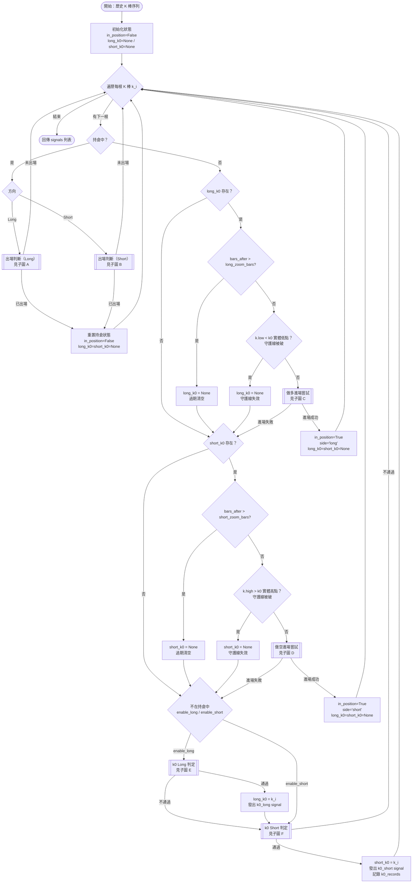
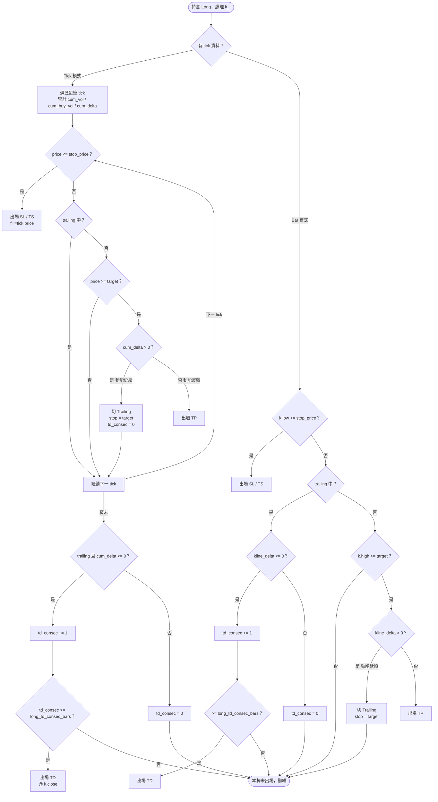
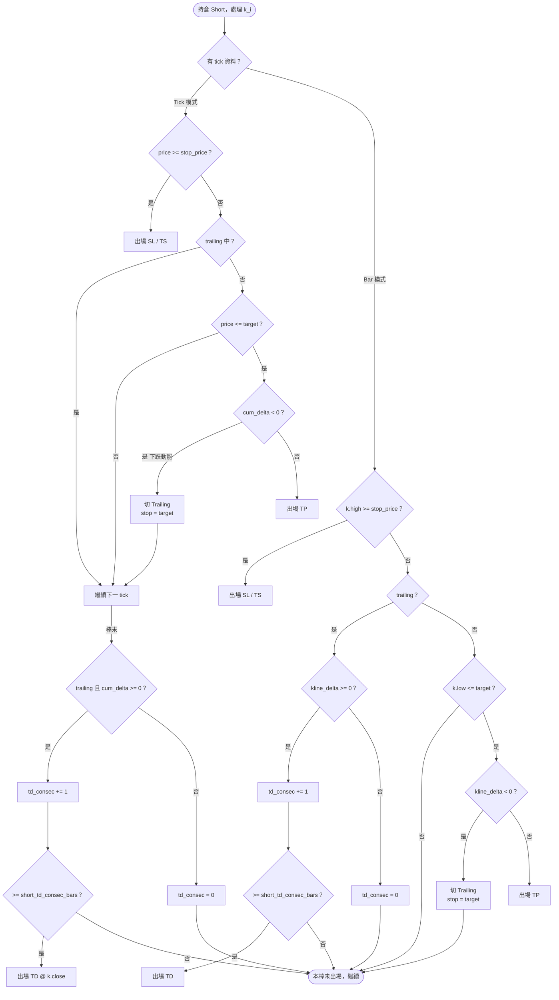
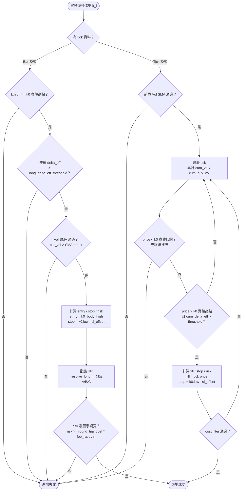
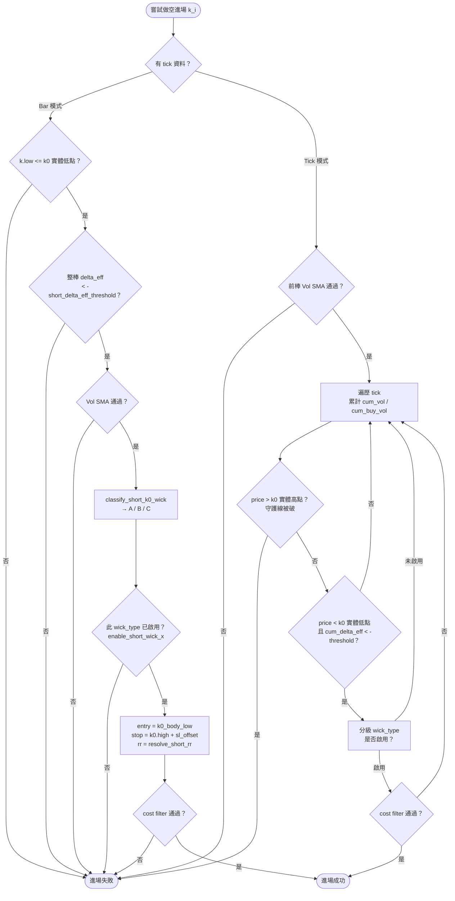
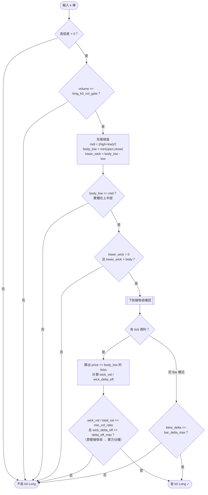
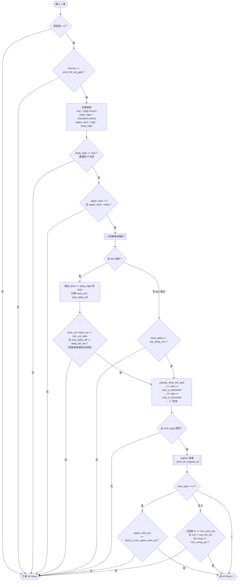
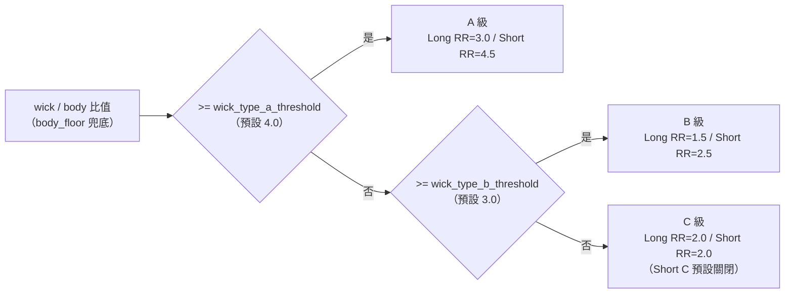

# Wick Reversal V4 — 策略流程圖

## 主流程

---

## 子圖 A — 做多出場

---

## 子圖 B — 做空出場（鏡像）

---

## 子圖 C — 做多進場條件

---

## 子圖 D — 做空進場條件（鏡像）

---

## 子圖 E — k0 Long 判定

---

## 子圖 F — k0 Short 判定

---

## 動態 RR 分級總覽

